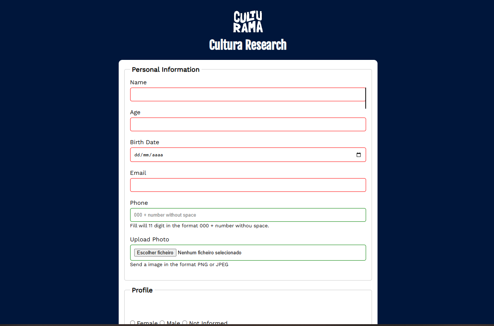

# Culturama Research Form 

Um projeto educacional desenvolvido durante o curso **HTML, CSS, Formulários, SEO e Acessibilidade** da Alura. O projeto consiste em um formulário de pesquisa cultural interativo com foco em boas práticas de SEO, acessibilidade web (WCAG) e validação de dados.

---



---

## Objetivo do Projeto

Criar um formulário de pesquisa que colha informações culturais dos usuários, aplicando as seguintes práticas:
- ✅ HTML semântico e acessível
- ✅ Otimização para SEO (meta tags, Open Graph)
- ✅ Validação de formulário
- ✅ Atributos ARIA para melhor acessibilidade
- ✅ Design responsivo com CSS moderno

## Estrutura do Projeto

```
pesquisa-culturama/
├── index.html              # Página principal com o formulário
├── sucess.html             # Página de sucesso após envio
├── css/
│   └── style.css           # Estilos globais do projeto
├── img/                    # Imagens do projeto (logo, etc)
└── README.md              # Documentação do projeto
```

## Ferramentas de SEO e Acessibilidade

### 1. **Google Chrome Lighthouse**

Ferramenta integrada no Chrome DevTools para auditoria de performance, SEO e acessibilidade.

**Como usar:**
1. Abra o projeto no navegador Chrome
2. Pressione `F12` ou clique em `Ctrl+Shift+I` para abrir DevTools
3. Vá para a aba **Lighthouse**
4. Selecione as categorias desejadas (Performance, Accessibility, Best Practices, SEO, PWA)
5. Clique em **Analyze page load**
6. Aguarde a análise completar

**O que verificar:**
- Performance e velocidade de carregamento
- Acessibilidade WCAG
- Boas práticas web
- SEO básico e técnico
- Conformidade com Progressive Web App (PWA)

**Métricas importantes:**
- Largest Contentful Paint (LCP)
- First Input Delay (FID)
- Cumulative Layout Shift (CLS)
- Accessibility Score (alvo: 90+)

---

### 2. **WAVE (Web Accessibility Evaluation Tool)**

Ferramenta especializada em acessibilidade web que identifica problemas de contraste, estrutura de página, etc.

**Link:** https://wave.webaim.org/

**Como usar:**
1. Acesse https://wave.webaim.org/
2. Copie a URL do seu projeto (ex: `https://thompsoncarlos.github.io/pesquisa-culturama-html-css/`)
3. Cole no campo de entrada na página do WAVE
4. Clique em "Submit" ou pressione Enter
5. Analise os resultados

**O que procurar:**
- **Erros (Errors):** Problemas críticos de acessibilidade (rótulos ausentes, contraste inadequado, etc)
- **Avisos (Alerts):** Possíveis problemas que precisam verificação manual
- **Estrutura (Structure):** Hierarquia de headings, landmarks, etc
- **Recursos** (Features): Elementos acessíveis encontrados

**Problemas comuns encontrados:**
- Falta de labels em inputs
- Contraste de cores insuficiente
- Imagens sem texto alternativo (alt text)
- Hierarquia de headings incorreta
- Falta de atributos ARIA

---

### 3. **Open Graph Preview Tool**

Ferramenta para validar e visualizar como seu site aparecerá quando compartilhado em redes sociais.

**Link:** https://www.opengraph.xyz/

**Como usar:**
1. Acesse https://www.opengraph.xyz/
2. Copie a URL do seu projeto na barra de entrada
3. Clique no botão de análise ou pressione Enter
4. Visualize como aparecerá no Facebook, Twitter, LinkedIn, etc

**Meta tags Open Graph utilizadas no projeto:**
```html
<meta name="og:title" content="Culturama Research">
<meta name="og:description" content="Cultural research from Culturama, your participation it's important for us.">
<meta name="og:image" content="https://[...]img/logo-branco.png">
<meta name="og:type" content="website">
<meta name="og:url" content="https://[...]/pesquisa-culturama-html-css/">
```

**O que verificar:**
- Imagem do Open Graph exibida corretamente
- Título aparecendo como esperado
- Descrição legível e atraente
- URL correta no preview

---

## Como Executar e Testar

### 1. Clonar o Repositório
```bash
git clone https://github.com/thompsoncarlos/pesquisa-culturama-html-css.git
cd pesquisa-culturama-html-css
```

### 2. Abrir Localmente
```bash
# Opção 1: Abrir com Live Server (VS Code)
# Instale a extensão Live Server e clique em "Go Live"

# Opção 2: Usar Node.js http-server
npx http-server
```

### 3. Testar Acessibilidade
1. Abra Chrome DevTools (F12)
2. Vá para Lighthouse → Selecione "Accessibility"
3. Clique "Analyze page load"
4. Ou acesse https://wave.webaim.org/ com a URL do seu projeto

### 4. Testar SEO e Open Graph
1. Acesse https://www.opengraph.xyz/
2. Cole a URL do seu projeto
3. Verifique se meta tags estão corretas

### 5. Testar Validação do Formulário
1. Tente enviar o formulário sem preencher campos obrigatórios
2. Tente enviar com data inválida
3. Teste com valores fora do range (idade < 12 ou > 100)
4. Verifique se os erros aparecem corretamente

---

## Boas Práticas Aplicadas

### HTML Semântico
- Uso de `<header>`, `<main>`, `<section>`, `<fieldset>`, `<legend>`
- Atributos `for` e `id` para associar labels aos inputs
- Elementos de formulário estruturados corretamente

### CSS Moderno
- CSS Variables (custom properties) para reutilização de valores
- Design responsivo com viewport meta tag
- Preconnect para otimizar carregamento de fontes externas

### Validação
- Atributos HTML nativos: `required`, `type`, `min`, `max`
- Tipos de input: `text`, `number`, `date`, `email`, `tel`, `color`, `file`
- Validação no formulário antes de envio

### Acessibilidade (WCAG)
- ARIA labels para elementos sem texto visível
- Roles semânticas nos elementos apropriados
- Contraste de cores adequado
- Navegação apenas com teclado

### SEO
- Meta tags descritivas
- Open Graph para compartilhamento social
- Favicon para identidade visual
- Preload de recursos críticos

---

## Recursos Educacionais

- [MDN - Acessibilidade Web](https://developer.mozilla.org/pt-BR/docs/Web/Accessibility)
- [WCAG 2.1 Guidelines](https://www.w3.org/WAI/WCAG21/quickref/)
- [Google SEO Starter Guide](https://developers.google.com/search/docs)
- [Open Graph Protocol](https://ogp.me/)
- [Lighthouse Documentation](https://developers.google.com/web/tools/lighthouse)

---

## 🔗 Links Úteis

- **Projeto Live:** https://thompsoncarlos.github.io/pesquisa-culturama-html-css/
- **GitHub Repository:** https://github.com/thompsoncarlos/pesquisa-culturama-html-css
- **WAVE (Acessibilidade):** https://wave.webaim.org/
- **Open Graph Tool:** https://www.opengraph.xyz/
- **Chrome Lighthouse:** Acessível via DevTools (F12 > Lighthouse)


