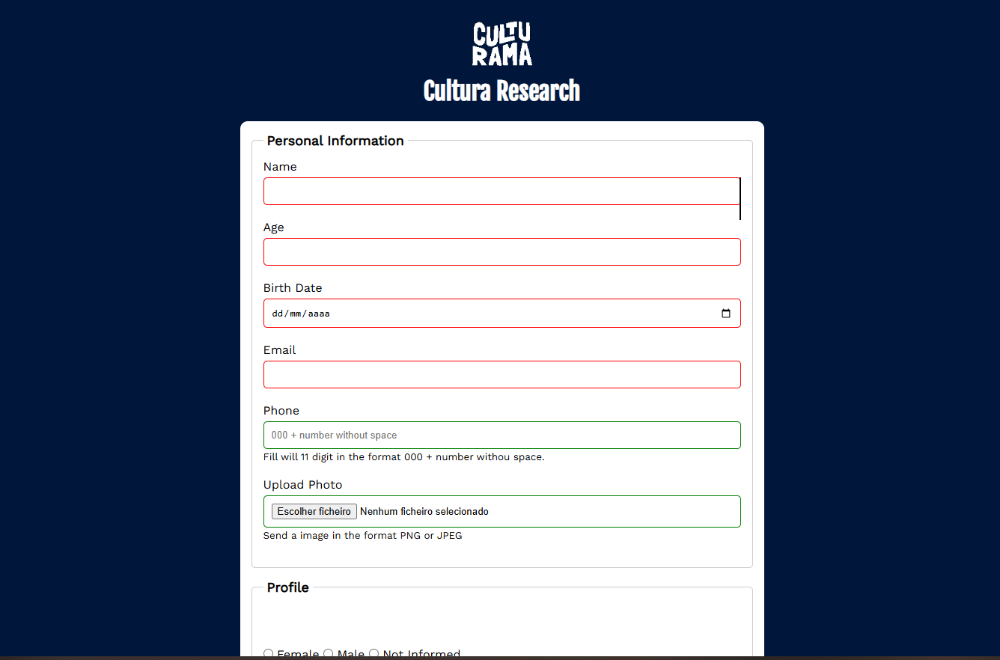

# Culturama Research Form
 
An educational project developed during the **HTML, CSS, Forms, SEO, and Accessibility** course by Alura. This project consists of an interactive cultural research form focused on SEO best practices, web accessibility (WCAG), and data validation.
 
---



---

## Project Objective
 
Create a research form that collects cultural information from users while applying the following practices:
 
- ✅ Semantic and accessible HTML
- ✅ SEO optimization (meta tags, Open Graph)
- ✅ Form validation
- ✅ ARIA attributes for improved accessibility
- ✅ Responsive design with modern CSS
 
## Project Structure
 
```text
pesquisa-culturama/
├── index.html # Main page containing the form
├── success.html # Success page displayed after submission
├── css/
│ └── style.css # Global project styles
├── img/ # Project images (logo, etc.)
└── README.md # Project documentation
````

## SEO and Accessibility Tools

### 1. **Google Chrome Lighthouse**

A tool integrated into Chrome DevTools for auditing performance, SEO, and accessibility.

**How to use:**
1. Open the project in Google Chrome
2. Press F12 or Ctrl+Shift+I to open DevTools
3. Go to the Lighthouse tab
4. Select the desired categories (Performance, Accessibility, Best Practices, SEO, PWA)
5. Click Analyze page load
6. Wait for the analysis to complete

**What to check:**
- Performance and page loading speed
- WCAG accessibility compliance
- Web best practices
- Basic and technical SEO
- Progressive Web App (PWA) compliance

**Important metrics:**
- Largest Contentful Paint (LCP)
- First Input Delay (FID)
- Cumulative Layout Shift (CLS)
- Accessibility Score (alvo: 90+)

---

### 2. **WAVE (Web Accessibility Evaluation Tool)**

A specialized web accessibility tool that identifies issues related to contrast, page structure, and more.

**Link:** https://wave.webaim.org/

**What to look for:**
1. Visit https://wave.webaim.org/
2. Copy the URL of your project (e.g., https://thompsoncarlos.github.io/pesquisa-culturama-html-css/)
3. Paste it into the input field on the WAVE page
4. Click Submit or press Enter
5. Review the results

**O que procurar:**
- **Erros (Errors):** Problemas críticos de acessibilidade (rótulos ausentes, contraste inadequado, etc)
- **Avisos (Alerts):** Possíveis problemas que precisam verificação manual
- **Estrutura (Structure):** Hierarquia de headings, landmarks, etc
- **Recursos** (Features): Elementos acessíveis encontrados

**Common issues found:**
- Missing labels on inputs
- Insufficient color contrast
- Images without alternative text (alt text)
- Incorrect heading hierarchy
- Missing ARIA attributes

---

### 3. **Open Graph Preview Tool**

A tool used to validate and preview how your website will appear when shared on social media platforms.

**Link:** https://www.opengraph.xyz/

**How to use:**
1. Visit https://www.opengraph.xyz/
2. Paste your project URL into the input field
3. Click the analyze button or press Enter
4. Preview how it will appear on Facebook, Twitter, LinkedIn, and other platforms

**Meta tags Open Graph utilizadas no projeto:**
```html
<meta name="og:title" content="Culturama Research">
<meta name="og:description" content="Cultural research from Culturama, your participation it's important for us.">
<meta name="og:image" content="https://[...]img/logo-branco.png">
<meta name="og:type" content="website">
<meta name="og:url" content="https://[...]/pesquisa-culturama-html-css/">
```

**What to verify:**
- Open Graph image displays correctly
- Title appears as expected
- Description is readable and engaging
- Correct URL is shown in the preview

---

## How to Run and Test

### 1. Clone the Repository
```bash
git clone https://github.com/thompsoncarlos/pesquisa-culturama-html-css.git
cd pesquisa-culturama-html-css
```

### 2. Open locally
```bash
# Option 1: Open with Live Server (VS Code)
# Install the Live Server extension and click "Go Live"

# Option 2: Use Node.js http-server
npx http-server
```

### 3. Testar Acessibilidade
1. Abra Chrome DevTools (F12)
2. Vá para Lighthouse → Selecione "Accessibility"
3. Clique "Analyze page load"
4. Ou acesse https://wave.webaim.org/ com a URL do seu projeto

### 4. Testar SEO e Open Graph
1. Acesse https://www.opengraph.xyz/
2. Cole a URL do seu projeto
3. Verifique se meta tags estão corretas

### 5. Testar Validação do Formulário
1. Tente enviar o formulário sem preencher campos obrigatórios
2. Tente enviar com data inválida
3. Teste com valores fora do range (idade < 12 ou > 100)
4. Verifique se os erros aparecem corretamente

---

## Best Practices Applied

### Semantic HTML 
- Use of `<header>`, `<main>`, `<section>`, `<fieldset>`, `<legend>`
- `for` and `id` attributes to associate labels with inputs
- Properly form elements  structure

### Modern CSS
- CSS Variables (custom properties) para reutilização de valores
- Responsive Design with viewport meta tag
- Preconnect to optimise loading of external fonts
- 
### Validation
- Atributes natives HTML: `required`, `type`, `min`, `max`
- Input types: `text`, `number`, `date`, `email`, `tel`, `color`, `file`
- Validação no formulário antes de envio

### Accessibility (WCAG)
- ARIA labels para elementos sem texto visível
- Roles semânticas nos elementos apropriados
- Contraste de cores adequado
- Navegação apenas com teclado

### SEO
- Meta tags descritivas
- Open Graph para compartilhamento social
- Favicon para identidade visual
- Preload de recursos críticos

---

## Educationals Resources

- [MDN - Acessibilidade Web](https://developer.mozilla.org/pt-BR/docs/Web/Accessibility)
- [WCAG 2.1 Guidelines](https://www.w3.org/WAI/WCAG21/quickref/)
- [Google SEO Starter Guide](https://developers.google.com/search/docs)
- [Open Graph Protocol](https://ogp.me/)
- [Lighthouse Documentation](https://developers.google.com/web/tools/lighthouse)

---

## 🔗 Links Úteis

- **Projeto Live:** https://thompsoncarlos.github.io/pesquisa-culturama-html-css/
- **GitHub Repository:** https://github.com/thompsoncarlos/pesquisa-culturama-html-css
- **WAVE (Acessibilidade):** https://wave.webaim.org/
- **Open Graph Tool:** https://www.opengraph.xyz/
- **Chrome Lighthouse:** Acessível via DevTools (F12 > Lighthouse)


